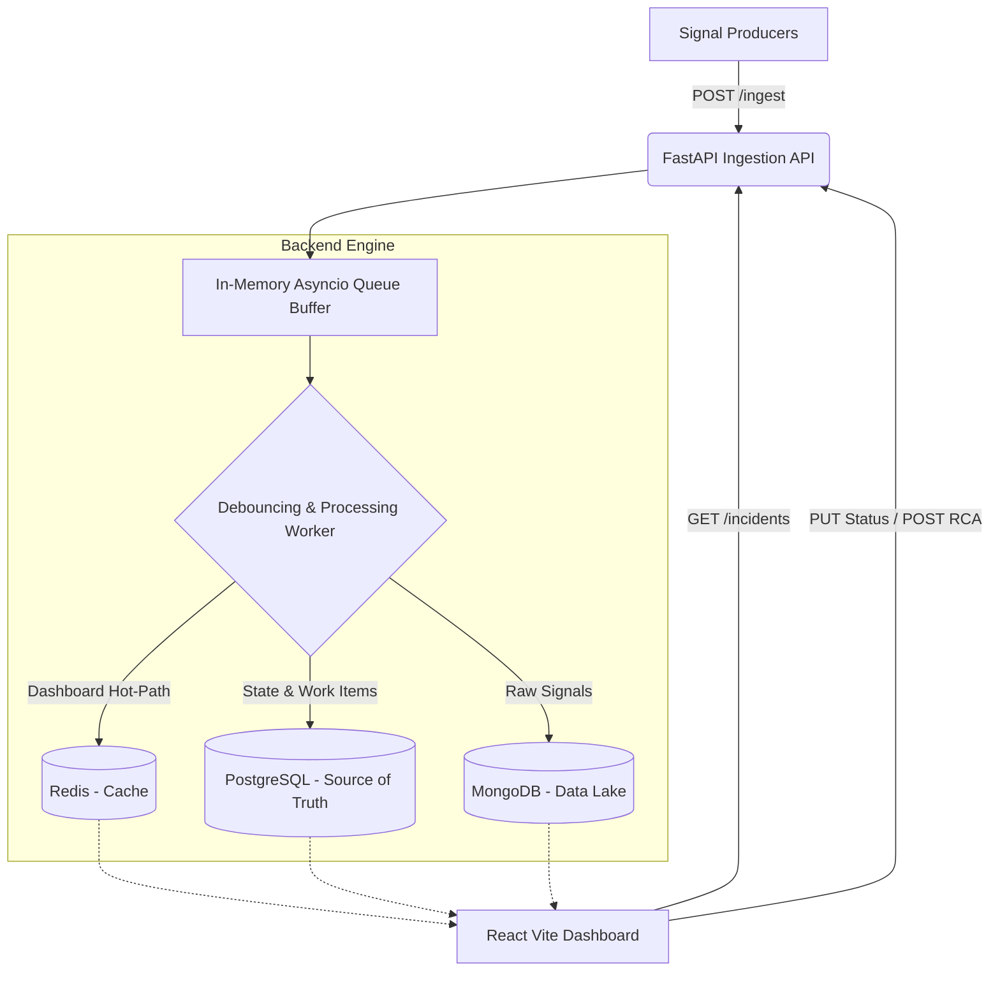

# Incident Management System (IMS)

A resilient, scalable Incident Management System designed to ingest high-volume signals, automatically create and track work items, and require Root Cause Analysis for resolution. 

## Architecture Diagram



## Features

1. **High-Throughput Ingestion**: Can handle bursts of 10,000+ signals/sec using FastAPI and an in-memory `asyncio.Queue` buffer.
2. **Backpressure & Rate Limiting**: The `/ingest` API is rate-limited using `slowapi` to prevent cascading failures. The async queue absorbs bursts, while the debouncing worker batches database inserts.
3. **Debouncing**: 100+ signals for the same component within a few seconds result in a single Work Item creation, preventing duplicate alerts.
4. **Resilience**: Asynchronous architecture ensures the API remains fast even if the database slows down.
5. **Design Patterns**: 
    - **Strategy Pattern** for Alert Severity (`backend/app/alerting.py`)
    - **State Pattern** for Incident Transitions (`backend/app/state.py`)
6. **Mandatory RCA**: Work items cannot be moved to CLOSED without submitting RCA details. Calculates MTTR automatically.

## Tech Stack

- **Backend**: Python 3.11, FastAPI, SQLAlchemy (Async), Motor (MongoDB Async), Redis.asyncio
- **Frontend**: React 18, Vite, TailwindCSS
- **Storage**: PostgreSQL (Source of Truth), MongoDB (Data Lake), Redis (Hot Cache)

## How to Run

Docker Compose is the recommended way to run this stack.

```bash
docker-compose up --build -d
```

- **Frontend Dashboard**: `http://localhost:80`
- **Backend API**: `http://localhost:8000`
- **API Docs**: `http://localhost:8000/docs`

## Simulating Failures

A Python script is provided to simulate an infrastructure outage. It requires `httpx` (or `requests`) and `asyncio` to pump signals into the ingestion API.

Ensure the application is running, then execute:

```bash
pip install httpx
python simulate_failure.py
```

This will trigger:
1. RDBMS Outage (P0)
2. Cache Failure (P2)
3. API Gateway Latency (P1)

Check the React Dashboard at `http://localhost:80` to see incidents populate in real-time.

## Handling Backpressure

Backpressure is managed at two layers:
1. **Rate Limiting Layer**: The API refuses connections beyond 10,000 requests per minute per IP using a token bucket approach.
2. **Asynchronous Queuing**: Signals are immediately pushed to an `asyncio.Queue` and a 202 Accepted response is returned. The worker processes the queue in batches. If the DB is slow, the queue grows but the API remains responsive. If memory boundaries are reached, the rate limiter prevents OOM by rejecting new signals. MongoDB bulk inserts handle high throughput efficiently without locking the application.
